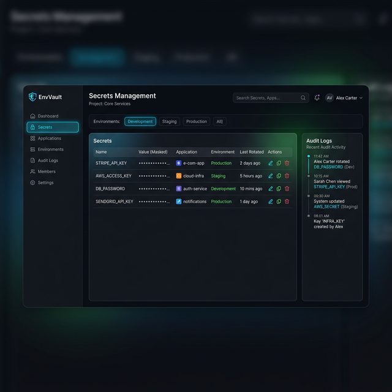

# 🔐 EnvVault: Enterprise-Grade Secrets Management


**EnvVault** is a robust, secure, and centralized secrets management platform designed to help development teams store, manage, and distribute environment variables safely across different stages (Development, Staging, Production).

---

## 🎨 Dashboard Preview


*Modern, high-performance interface for managing enterprise secrets.*

---

## 🏗️ System Architecture


*Detailed flow of authentication, secret retrieval, and audit logging.*

---

## 🚀 Key Features

-   **Dual-Layer Authentication**: Secure access using environment-specific API keys and user identity tokens.
-   **Environment Filtering**: Seamlessly toggle between `Development`, `Staging`, and `Production` versions of your secrets.
-   **Real-time Audit Logs**: Every action (reveal, create, update, delete) is timestamped and logged for compliance.
-   **Security First**: Variables are masked by default. Reveal only what you need, when you need it.
-   **Smart Exports**: Generate `.env` files dynamically for any environment with one click.
-   **Neon Serverless Integration**: Powered by a high-availability, serverless PostgreSQL database.

---

## 🛠️ Technology Stack

### Frontend
-   **Framework**: [Next.js 15+](https://nextjs.org/) (App Router)
-   **Styling**: [Tailwind CSS 4](https://tailwindcss.com/)
-   **Icons**: [Lucide React](https://lucide.dev/)
-   **HTTP Client**: [Axios](https://axios-http.com/)

### Backend
-   **Runtime**: [Node.js](https://nodejs.org/)
-   **Server**: [Express.js 5](https://expressjs.com/)
-   **Database**: [Neon PostgreSQL](https://neon.tech/)
-   **Auth**: [JWT (JSON Web Tokens)](https://jwt.io/) & [Bcrypt.js](https://github.com/dcodeIO/bcrypt.js)
-   **Utilities**: `pg`, `dotenv`, `uuid`, `cors`

---

## ⚙️ Installation & Setup

### 1. Prerequisites
- Node.js (v18 or higher)
- A Neon PostgreSQL account and database instance

### 2. Backend Setup
```bash
cd EnvVault/envvault-backend
npm install
```
Create a `.env` file in `envvault-backend/`:
```env
PORT=5000
DATABASE_URL=your_neon_connection_string
JWT_SECRET=your_secure_jwt_secret
```
Run migrations (if applicable) and start:
```bash
npm run dev
```

### 3. Frontend Setup
```bash
cd EnvVault/envvault-frontend
npm install
```
Start the development server:
```bash
npm run dev
```
Open [http://localhost:3000](http://localhost:3000) to access the dashboard.

---

## 📁 Project Structure

```text
EnvVault/
├── envvault-backend/    # Express.js API Layer
│   ├── src/
│   │   ├── controllers/ # Business logic
│   │   ├── routes/      # API Endpoints
│   │   ├── middleware/  # Auth & Logging guards
│   │   └── server.js    # Entry point
├── envvault-frontend/   # Next.js Application
│   ├── src/
│   │   ├── app/         # Pages & Layouts
│   │   ├── components/  # Reusable UI elements
│   ├── public/         # Static assets & diagrams
```

---

## 🔒 Security Constraints

-   All endpoints are protected by `JWT` middleware.
-   Secrets are encrypted at rest (if database-level encryption is enabled).
-   API keys are used for application-level machine-to-machine validation.
-   Masking logic ensures sensitive data is never exposed in bulk by default.

---

## 📄 License

This project is licensed under the MIT License - see the [LICENSE](LICENSE) file for details.
